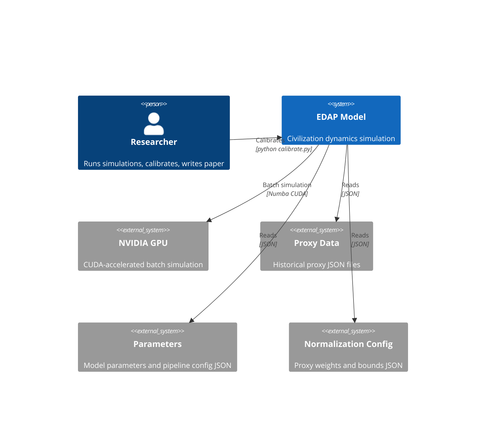
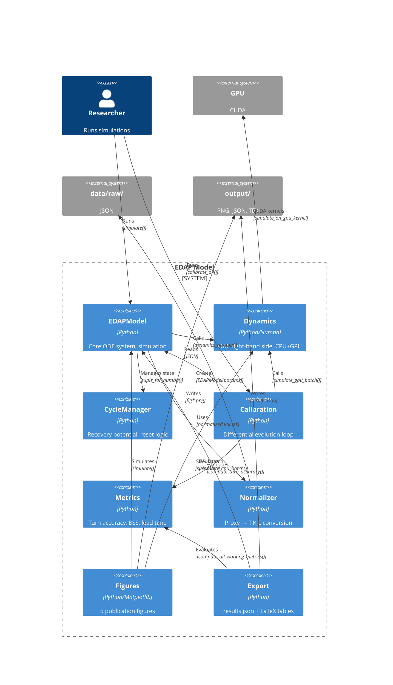

# INTERFACES.md — System Architecture and Module Contracts

## Purpose
Defines the architecture of the EDAP model at two levels:
- **Context**: how EDAP interacts with external systems (data sources, user, GPU, output)
- **Container**: how modules within EDAP interact (model, dynamics, cycles, calibration, figures)

This file enables reconstruction of the full system from base documents (ADR, THESES, GUARDRAILS) by specifying *what connects to what* and *with what contract*.

---

## Context Diagram (C4 Level 1)



## Container Diagram (C4 Level 2)



## Module Contracts

### EDAPModel → Dynamics
- **Direction:** model calls dynamics
- **Method:** `dynamics(t, y)` → returns `[dT, dK, dC]`
- **GPU path:** `simulate_gpu_batch(model, T0, K0, C0, n_simulations, t_span, n_steps, seed)` → returns `(T_arr, K_arr, C_arr)`
- **Contract:** dynamics functions take (T, K, C) plus all parameters as scalars. Return derivatives.
- **Sync requirement:** Any equation change must update both `dynamics_cpu_single` and `simulate_on_gpu_kernel`.

### EDAPModel → CycleManager
- **Direction:** model owns a CycleManager instance as `self.cycles`
- **Key calls:**
  - `cycles.tuple_for_numba()` — packs cycle state for dynamics kernel
  - `cycles.update_from_numba(recovery_potential, in_reset_zone, rng_state)` — post-step state update, applies decay on reset exit
  - `cycles.reset()` — called at start of each `simulate()`
- **Contract:** CycleManager holds mutable state. Model delegates cycle logic entirely.

### Calibration → EDAPModel + Dynamics + Metrics
- **Direction:** calibration creates models, calls GPU batch, evaluates metrics
- **Flow:**
  1. `EDAPModel(params)` — create model with candidate parameters
  2. `simulate_gpu_batch(model, T0, K0, C0, n_gpu_sims, t_span, n_steps, seed)` — GPU batch simulation
  3. `compute_turn_accuracy(norm_data, sim_result, sim_years)` + `compute_brier_skill_score(norm_data, sim_result, sim_years, model)` — evaluate
  4. Return `-(TA + BSS) + penalty_weight * penalty` as objective value
- **Contract:** Calibration does NOT use `model.simulate()` — uses direct GPU batch path for speed.

### Normalizer → Proxy Data
- **Direction:** normalizer reads JSON, produces T, K, C
- **Key calls:**
  - `normalizer.normalize(raw_point)` → `(T, K, C)`
  - `normalizer.normalize_civilization(civ_data)` → `[{year, T, K, C, label, is_projection?}]`
- **Contract:** Weights and min/max bounds from `data/normalization_params.json`. Input keys must match proxy names in raw JSON.

### Figures → EDAPModel + Dynamics + Output
- **Direction:** figures call model for simulation, write PNG to output
- **GPU usage:** `fig4_montecarlo.py` uses `simulate_gpu_batch()`. All others use `model.simulate()`.
- **Contract:** Each figure function takes `(normalizer, model_params, save_path)`. Figures are independent — can be generated in any order.

### Export → EDAPModel + Metrics + Output
- **Direction:** export calls model, evaluates metrics, writes JSON + LaTeX tables
- **Flow:** For each civilization: simulate → compute working metrics → write results
- **Contract:** Uses `model.simulate()` (CPU path). Results written to `output/results.json`. LaTeX tables generated from results via `latex_export.generate_latex_tables()`.

## Build Pipeline

### Step 1: Normalize
```
Normalizer("data/normalization_params.json")
for each file in data/raw/*.json:
    normalizer.normalize_civilization(raw_data)
```

### Step 2: Simulate
```
model = EDAPModel(parameters)
model.cycles.historical_T_peak = max(T_actual)
model.simulate(T0, K0, C0, t_span)  → {t, T, K, C, S, K_crit}
```

### Step 3: Evaluate
```
metrics.compute_all_working_metrics(norm_data, sim_result, sim_years, model)
→ {turn_accuracy, turn_details, k_crossing_lead_years, brier_skill_score}
```

### Step 4: Export Results
```
export.export_results_json(model_params, normalizer, "output/results.json")
```

### Step 5: Generate LaTeX Tables
```
latex_export.generate_latex_tables("output/results.json", "output/")
→ output/table_parameters.tex
→ output/table_turn_accuracy.tex
→ output/table_metrics.tex
→ output/table_turns_*.tex
```

### Step 6: Generate Figures
```
figures.fig1_phase.phase_portrait(normalizer, model_params, "output/fig1.png")
figures.fig2_timeseries.time_series(normalizer, model_params, "output/fig2.png")
figures.fig3_bifurcation.bifurcation(model_params, "output/fig3.png")
figures.fig4_montecarlo.monte_carlo(normalizer, model_params, "output/fig4.png")
figures.fig5_summary.summary_table("output/fig5.png")
```

### Step 7: Compile Paper
```
cd paper/
pdflatex article.tex
bibtex article
pdflatex article.tex
pdflatex article.tex
→ paper/article.pdf
```

### Entry Points
- **Full pipeline:** `python run_model.py` (Steps 1-6)
- **Calibration only:** `python calibrate.py` (updates parameters.json)
- **Tests:** `pytest tests/test_model.py -v`

## Data Flow

```
data/raw/*.json
    │
    ▼
Normalizer.normalize_civilization()
    │
    ▼
┌──────────────────────────────────────┐
│ EDAPModel.simulate()                 │
│   ├── dynamics_numba()  [CPU: @njit] │
│   └── cycles.tuple_for_numba()       │
└──────────────────────────────────────┘
    │
    ├──► metrics.compute_all_working_metrics()
    │         │
    │         ▼
    │    export.export_results_json()
    │         │
    │         ▼
    │    output/results.json
    │         │
    │         ▼
    │    latex_export.generate_latex_tables()
    │         │
    │         ▼
    │    output/table_*.tex
    │
    └──► figures/fig1-5_*.py
              │
              ▼
         output/fig*.png
```

## GPU Path (Batch)

```
calibration.objective()
    │
    ▼
simulate_gpu_batch(model, T0, K0, C0, n_sims, ...)
    │
    ▼
cuda.to_device() → simulate_on_gpu_kernel[blocks, threads] → copy_to_host()
    │
    ▼
metrics.compute_turn_accuracy() + compute_brier_skill_score()
```

## Key Architectural Invariants

- Model NEVER requires CUDA. `HAS_CUDA` checked once; CPU fallback always available.
- Equations MUST be identical in `dynamics_cpu_single` and `simulate_on_gpu_kernel`.
- CycleManager state is reset at start of each `simulate()` call.
- All figures are independent — can be generated in any order.
- Calibration does NOT use `model.simulate()` — direct GPU batch path.
- Export uses CPU path (`model.simulate()`) for final metrics.
- GPU path and CPU path must produce identical results within numerical tolerance.
- Any equation change MUST update both CPU and GPU implementations.
